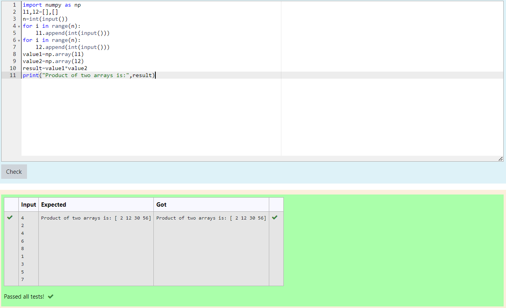

# Multiplying-two-matrix

## AIM:
To write a python programming for multiplying two matrices
## ALGORITHM:

### Step 1:
Import numpy as np
### Step 2:
Give the inputs 
### Step 3:
Use the forloop and range function
### Step 4:
Multiply the two matrices
### Step 5:
Check and verify the program
## PROGRAM:
~~~ 
##Program Developed by: K.Balaji
##Reference number: 21005757
import numpy as np
l1,l2=[],[]
n=int(input())
for i in range(n):
    l1.append(int(input()))
for i in range(n):
    l2.append(int(input()))
value1=np.array(l1)
value2=np.array(l2)
result=value1*value2
print("Product of two arrays is:",result)
~~~

## OUTPUT:

## RESULT:
Thus the program is written to multiply two matrices using python programming

